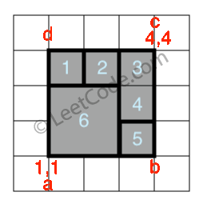
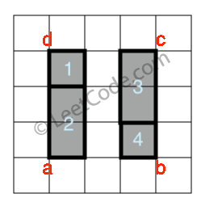
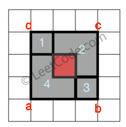

<!--
 * @Author: Hiseh
 * @Date: 2019-10-09 10:24:36
 * @LastEditors: Hiseh
 * @LastEditTime: 2019-10-09 21:17:53
 * @Description: 
 -->
# 完美矩形 
[返回首页](../README.md)

比如下面就是个完美矩形:
> [[1,1,3,3],[3,1,4,2],[3,2,4,4],[1,3,2,4],[2,3,3,4]]<br/>
> <br/>
> S<sub>1</sub> + S<sub>2</sub> + S<sub>3</sub> + S<sbu>4</sub> + S<sub>5</sub> + S<sub>6</sbu> = S<sub>abcd</sub>

而下面两类情况的图形不是完美矩形：1、小矩形总面积与大矩形面积不相符。
> [[1,1,2,3], [1,3,2,4], [3,1,4,2], [3,2,4,4]]<br/>
> <br/>
> S<sub>1</sub> + S<sub>2</sub> + S<sub>3</sub> + S<sbu>4</sub> ≠ S<sub>abcd</sub>

2、矩形之间有重叠
> [[1,1,3,3], [3,1,4,2], [1,3,2,4], [2,2,4,4]]<br/>
> <br/>

代码通过上述两个条件判断即可。
## Python
```python
class Solution:
    def isRectangleCover(self, rectangles: list) -> bool:
        total_area = 0
        corners = set()

        # 计算矩形面积
        rect_area = lambda: (c_x - a_x) * (c_y - a_y)

        # 统计四个顶点坐标
        chk_corners = lambda: {(a_x, a_y), (c_x, a_y), (c_x, c_y), (a_x, c_y)}
        for a_x, a_y, c_x, c_y in rectangles:
            # 小矩形总面积
            total_area += rect_area()

            # 取得对称差集
            corners ^= chk_corners()
        
        # 获取最大和最小坐标(大矩形坐标)
        a_x, a_y, c_x, c_y = (f(z) for f, z in zip((min, min, max, max), zip(*rectangles)))

        # 检查两个条件是否满足
        return total_area == rect_area() and corners == chk_corners()
```
---

## C
用循环实现Python的zip函数，用HashTable模拟set集合，其它思路同Python。
```c
```
[返回首页](../README.md)